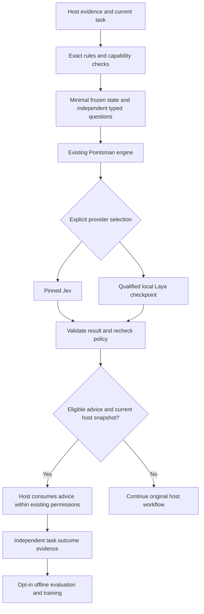

# Cross-agent decision architecture

Status: proposed design, 2026-10-03. This document describes a proposed extension
of Pointsman, not newly implemented host support. Source baseline: `39bf5a4`.

## Scope and acceptance

The requested deliverable is a public architecture and training plan, updated
README/package/repository descriptions, and a commit pushed to the existing
branch. Runtime implementation, installation, mode changes, training, paid API
evaluation and checkpoint promotion are outside this delivery.

The design must distinguish working code from proposed integrations; preserve
the shared Jev/Laya engine, host permissions and explicit operator controls; and
define separate evidence for task success/cost/latency, decision quality and
broad generalization. The companion [training plan](TRAINING_PLAN.md) owns the
learning and comparison details. Existing private `docs/` notes stay private.

| Required output | Consumer | Verification | Status |
|---|---|---|---|
| Article assessment and integration design | Maintainers and host adapters | Source/API cross-check | Prepared |
| Local learning feasibility and staged plan | Training pipeline maintainers | Current trainer/evidence contract cross-check | Prepared |
| README and descriptions | Repository users | Claims, links and public-only diff review | Prepared |
| Commit and push | Existing `origin/main` | Required offline checks and remote SHA readback | Publication attested by Git history and delivery report |

## Work graph for this documentation change

`article + source baseline -> architecture / training / host research -> root integration -> offline checks -> commit -> push/readback`.
Root is the only writer. Three read-only GPT-6.1 Sol nodes own architecture
(medium), training feasibility (high), and official host contracts (medium).
Each starts at revision 1 / attempt 1, has no child delegation and returns source
evidence; a reported finding is accepted only after reconciliation with the
current code. Changed inputs invalidate only dependent claims. Retry budget is
three attempts per node; no repeated passing checks without changed evidence.

Delivery checks (Node 26.5.0, Python 3.13.1): JavaScript syntax, the Node test
suite, 13 Python worker tests, offline smoke and all three demos. The initial
sandbox run passed 485 Node cases; 23 socket-bound cases hit `EPERM`, with further
server cases blocked behind that boundary. All five affected files then passed
their 72 cases with local socket permission. Unaffected passing files were not
rerun. This is offline evidence, not a native host or model-quality result.
The two content reviews used one bounded follow-up each; no worker wrote files
or ran training. One missing generalization-superiority criterion was corrected.

## Decision: one engine, thin host adapters

Keep [the existing engine](src/engine.mjs), selected-provider dispatcher in
[inference.mjs](src/inference.mjs), and the existing MCP/CLI/JavaScript entrypoints.
Do not introduce a model proxy, another credential store or an orchestration
framework. Pointsman is the toolkit; Jev is its remote provider; Laya is the local
runtime/base, and pointsman-router is the currently evaluated local checkpoint.
Transport compatibility does not make that checkpoint a general decision model.



There is no implicit Laya → Jev → another LLM chain. The original host remains
the continuation on uncertainty, OFF, SHADOW, timeout or unsupported capability.
It can use its existing model or ask a person under its normal workflow.
Selecting Jev for production and using Jev to develop a competing model are
different activities; the latter has the [training-plan restrictions](TRAINING_PLAN.md#data-rights-and-paid-work).

## What the article contributes

The supplied [Jev engineering article](https://x.com/polydao/article/2104783226833186920)
was read in full in the in-app browser on 2026-10-03. Its useful design ideas are
to inventory bounded decisions, leave exact rules in code, batch independent
questions over shared evidence, and retain an escalation path. Its case studies
and headline savings are not measurements of Pointsman. Kimi is an example of a
downstream model, not a dependency of this design.

We adapt the approach at explicit decision boundaries. A classifier does not
grant permissions, prove completion or replace exhaustive review. The article's
tool-risk, compaction, browser-control and trading examples do not expand this
repository's scope. A predicted “done” may select a verification step; only the
host's actual acceptance checks establish completion.

### Improvements over a classifier-first cascade

The owner authorized alternatives to the article on 2026-10-03. Prefer a
**utility-first integration**: insert a decision only when measured downstream
work avoided exceeds inference, host-turn, cache and failure-recovery overhead.
Use exact rules first and the normal host as the baseline, rather than assuming
every frontier decision is wasteful. An unnecessary extra judgment should be
removed even when the classifier is fast.

Train general question understanding and actual model×effort utility as distinct
targets. Calibrate at matched risk/coverage instead of one global confidence
number. Keep a host-controlled capability check and independent completion
evidence. These changes address costs the article's simple cascade leaves out;
their benefit is a hypothesis until the [evaluation gates](EVALUATION.md) pass.

## Current source and gaps

| Layer | Present implementation | Needed for the proposed extension |
|---|---|---|
| Typed decisions | [contracts](src/contracts.mjs), [engine](src/engine.mjs), `decideOrDelegate` | Version decision families and consumer contracts without duplicating inference |
| Interfaces | [stdio MCP](src/mcp.mjs), [stdin CLI](src/cli.mjs), JS exports in [package.json](package.json) | Capability-checked adapters for each additional host |
| Provider | [TypeSafe HTTPS](src/provider.mjs), [local inference](src/inference.mjs), [resident server](src/laya-server.mjs) | Purpose/family-specific qualification; explicit model/checkpoint identities |
| Routing/filtering | [control layer](src/control-layer.mjs), [routing](src/routing.mjs), [filtering](src/filtering.mjs) | New hosts cannot be passed to the current `route` schema, which accepts only Codex/Claude |
| Application | [owned hooks](src/hooks.mjs), [installer](src/installer.mjs) for two hosts | Native readback proving task visibility and the action actually taken |
| Learning | [evidence store](src/training/store.mjs), [dataset](src/training/dataset.mjs), [training kit](training/laya-kit/README.md), [lifecycle](src/training/laya-lifecycle.mjs) | Independent general-decision data, clean splits and outcome-based evaluation |

The source rechecks global/provider policy and cancellation after inference;
the feature layer also rechecks feature policy. These checks do **not** establish
that a file, candidate list or external host state is unchanged. `snapshot_id`
is an evidence identifier today. The adapter must check the actual consumer
snapshot immediately before application.

One relevant existing gap remains a follow-up, not a code change here:
`runHookCli` in `src/hooks.mjs` returns early when router mode is OFF, whereas
`processHookEvent` has event-specific router/effort gates. Independent effort
operation through the CLI needs a focused regression check and correction before
it can be accepted. A direct handler fixture alone would miss that entrypoint.

## Host capability matrix

Official documentation was consulted on 2026-10-03. It establishes documented
contracts, not installed-host verification. No native host test was run for this
documentation delivery.

| Host | Lowest common integration | Optional application path | Exact limitation / next evidence |
|---|---|---|---|
| Codex | Existing MCP `decide`; explicit, bounded advice | Documented `PreToolUse` input updates and configured subagent roles | Repo observation on CLI 0.154.0: opaque spawn input, recording only. Newer docs expose `spawn_agent`/`Agent`; prove readable input and executed role on the target version before enabling routing. No automatic pre-spawn MCP call by default. |
| Claude Code | Existing MCP decisions | Existing owned `Agent` hooks; separate effort mod | Verify `updatedInput`, model lock and actual subagent model. The effort mod is a distinct opt-in integration; ordinary command-hook observations do not establish general main-loop effort control. |
| Gemini CLI | Proposed explicit MCP client of the existing stdio server | Official `BeforeModel` can alter the request model/config | No Gemini installer/adapter/native evidence in this repo. Start with explicit decisions; hook automation is a later version-specific adapter. |
| Other MCP hosts | Explicit `decide` if stdio tools are supported | Only capabilities actually exposed by that host | MCP supplies tools, not universal control of the main model, context or subagent dispatch. |
| Owned SDK harness | JS engine, or CLI/MCP across a language boundary | The application owns state, selection and dispatch | Strongest integration boundary: use supported SDK model/run settings and verify the resulting invocation. This does not modify an existing desktop client's internals. |

Sources: [Codex MCP](https://learn.chatgpt.com/docs/extend/mcp?surface=cli),
[Codex hooks](https://learn.chatgpt.com/docs/hooks),
[Codex subagents](https://learn.chatgpt.com/docs/agent-configuration/subagents),
[Claude hooks](https://code.claude.com/docs/en/hooks),
[Claude subagents](https://code.claude.com/docs/en/sub-agents),
[Gemini hooks](https://geminicli.com/docs/hooks/reference/),
[Agents SDK models](https://developers.openai.com/api/docs/guides/agents/models).

Adapter capability records are **proposed**, not a current config schema. Keep
them beside an adapter's native test evidence, with host/version, transport,
readable task fields, allowed roles/models/efforts/skills, spawn/model/effort
write support, cancellation, outcome capture, verification date and evidence
revision. Unknown capabilities stay unavailable. Explicit model locks survive;
a role file's model/effort can override a spawn request. Never infer availability
from a marketing model name or bypass opaque host inputs.

## Decision and consumer contract

Preserve today's request fields: `purpose`, `risk`, `state`, `questions`, and
optional `trace` (`task_id`, `snapshot_id`, `comparison_id`). There is no new
wire protocol in this change. A future decision-family record should bind:

- Family ID/revision; question text, criteria and candidate-order hash.
- State builder/version, candidate IDs, evidence revision and freshness rule.
- Supported provider/checkpoint, input limits, calibration identity and gate.
- Host adapter/version, allowed consumer action, timeout and fallback.
- Label definition, independent outcome source and required regression set.

Keep this as data in the existing policy/evaluation path when implemented;
do not create a service or a plugin registry just to hold it. An example
consumer follows this sequence (pseudocode, not an added API):

```text
snapshot = host.freeze_minimal_evidence()
if exact_rule_applies(snapshot): return host.existing_rule_path()
if capability_or_scope_is_unknown(snapshot): return host.original_path()
result = existing_engine.decide(current_request(snapshot), signal)
if not result.apply: return host.original_path()
if host.snapshot_changed(snapshot): return host.original_path()
if advice_is_abstain_or_target_is_unavailable(result): return host.original_path()
return host.consume_advice_under_existing_authorization(result)
```

`apply=true` means eligible advice, never execution authorization or successful
dispatch. `authorizesExecution:false` remains invariant. Sensitive scope stays
with the host; `risk=routine` is not a trusted security assertion. The engine
already returns no consumable answers for SHADOW or rejected results.

For MCP, cancellation/disconnect already propagates to the engine. Direct JS
supports an AbortSignal. The one-shot CLI does not currently forward a caller
signal into `decide`; a wrapper must discard late output and enforce its own
deadline, or use the cancellation-aware transport. Cross-process global rate
limits are not implemented: each MCP/CLI process has its own limits. Keep
orchestrator-wide budgets in the host that already owns the work, and measure
contention before adding shared scheduling.

### Probability and input compatibility

Choice `confidence` is distinct from the selected option's probability. Noul
returns the probability of yes, with no separate provider confidence; 0.5 is
uncertainty, not a medium amount of a property. Score is a probability-weighted
**zero-based** level. Preserve these meanings through adapters and training.
Do not interpret confidence 0.9 as a demonstrated 90% success rate.
[TypeSafe API](https://docs.typesafe.ai/api),
[confidence semantics](https://docs.typesafe.ai/confidence).

The local wrapper currently permits up to 8 questions, 24,000 wire bytes,
2–16 Choice options, string instructions/criteria and 2–11 Score levels.
TypeSafe documents 2–10 Score levels, up to 255 Choice options and richer
instruction structures. Use **2–10** Score levels and the smaller common limits
for portable requests; the 11-level wrapper mismatch is a future contract fix,
not claimed API compatibility. A local checkpoint adds its own token/head
limits; the current model's 1024/256 budget must not be confused with Jev's
larger supported context. Oversized or unsupported requests return to the host.

Every Choice needs a meaningful `other`/`insufficient_evidence` candidate when
the answer set is not exhaustive. Such an answer means abstain at the consumer;
the generic engine does not automatically treat the string `other` specially.
The family test must establish candidate recall as well as selection quality.
Exact counts, dates, retry budgets and authorization checks stay deterministic.

### Batch only compatible questions

Freeze state once, then group independent questions that share its evidence and
consumer acceptance boundary. Questions cannot depend on answers in the same
call. New evidence or a decision-dependent candidate set starts another snapshot.
The engine currently applies a batch only if all its questions pass; unrelated
questions would create unnecessary abstention. Do not silently introduce partial
batch application. [TypeSafe fan-out](https://docs.typesafe.ai/patterns/fan-out).

The Laya worker may batch questions, but it encodes a question/state sequence for
each question; this is not proof of one shared state encoding. Local filtering
currently packs one item per request. Provider-level batching, encoder batching,
and saved host tool turns are different effects and require separate measurement.

## First useful decision families

| Family | Evidence and answer | Consumer / non-negotiable check |
|---|---|---|
| Skill or tool selection | Task plus a small, current candidate catalog; select or abstain | Load the chosen available description; preserve candidate recall and host approval |
| Retry strategy | Classified failure plus completed attempts and available recovery choices | Choose among authorized strategies; code enforces attempt/budget limits |
| Escalation | Task scope, failure evidence and actual available worker profiles | Recommend a profile; host validates lock, resource ownership and dispatch capability |
| Selective relevance | Source snippets with IDs and required-evidence flags | Keep uncertain/required sources; exhaustive work keeps all inputs without filtering |
| Verification selection | Acceptance clauses and current evidence IDs | Select the next check; successful command execution alone does not establish task completion |

Start with one frequent boundary where a costly downstream step can actually
disappear. Avoid blanket checking of every tool call. Current route qualification
does not qualify these other families; they stay host-owned until separately
evaluated. Task permissions, context deletion, trading and destructive-action
approval remain outside the classifier's responsibility.

## Rollout and acceptance for later implementation

| Phase | Bounded work | Acceptance / stop condition |
|---|---|---|
| A. Baseline and family contract | Inventory one real decision boundary; record normal host cost and quality | There is a measurable replaceable action; otherwise do not add a decision call |
| B. Adapter contract | Reuse `decide`, bind capabilities/snapshot, support cancellation and fallback | Same fixture semantics over intended transports; stale/unknown state never dispatches |
| C. Shadow | Explicitly opt in to the selected provider and minimal evidence | Observe recommendations and missing data; no quality or savings claim from agreement |
| D. Native application | Version-specific Claude/Codex or owned-harness test, one consumer at a time | Read back real selected role/model/effort and independent task results; fixture success is insufficient |
| E. Bounded adoption | Predeclared quality/risk/efficiency gates from the training plan | Adopt only passed family/provider/host revisions; explicit rollback remains available |

Implementation should extend existing tests: `engine`, `mcp`, `routing`, `hooks`,
`features-boundaries`, `effort`, and `laya-server`. Cover OFF/no call;
SHADOW/no consumed advice; invalid/low-confidence fallback; cancellation and
policy/provider changes; stale snapshots; model locks; unknown targets; opaque
Codex input; all-or-nothing batches; exhaustive evidence preservation;
checkpoint identity/purpose mismatch; and the actual CLI effort entrypoint.
Do not claim these proposed cases all have tests today.

A host/model/prompt/state-builder change invalidates only its dependent
qualification. Reuse unaffected passing evidence. Shared operational telemetry
stays content-free; any opt-in private training evidence is handled by the
existing store, never copied into public repository documents.

## Efficiency criterion

Measure completed tasks, not inference calls alone. Include extra model/tool
turns, input/output/thinking tokens, cache reads/writes, retries, warm/cold local
startup, queueing and human corrections. Compare with the host's normal competent
policy as well as a fixed strong-model reference. A routing hook often runs after
the host already thought about the choice; that thinking has not been saved.

The architecture succeeds only if consuming its decisions improves an accepted
quality/cost/latency tradeoff. It is falsified for a boundary when added overhead,
lost evidence, unsafe downsizing or repeated fallback outweighs the work removed.
Full quantitative gates and the separate Jev comparison are in
[EVALUATION.md](EVALUATION.md).
