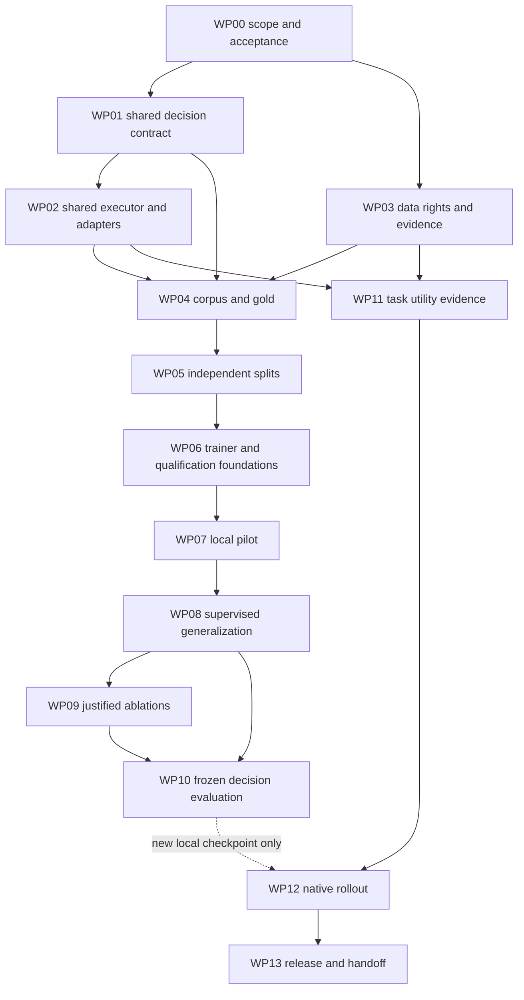
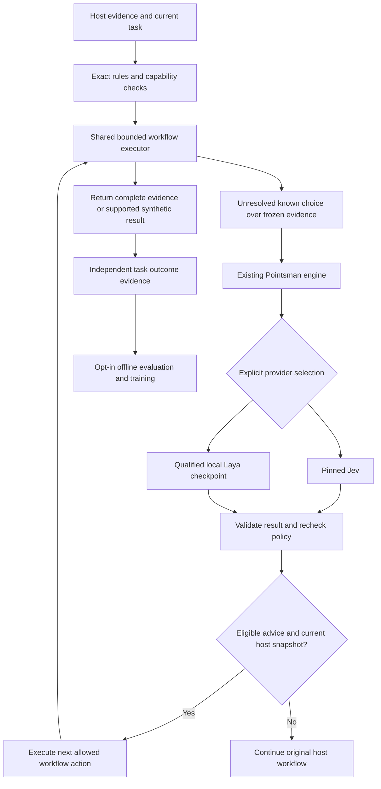

# Pointsman integrated architecture, learning and delivery plan

Updated: 2026-10-03. Status: **EXECUTION ACTIVE — owner authorized the complete checklist**.
Runtime source baseline: `39bf5a4`; original design bundle: `e18cd21`; first
consolidation: `b950227`. The revision below replaces routing-first priorities
with execution that removes repeated parent-model requests.
This is the single canonical public plan replacing `ARCHITECTURE.md`,
`TRAINING_PLAN.md` and `EVALUATION.md`. Their technical requirements, sources and
evidence limitations are consolidated below; the work packages turn them into
executable checklists. It remains one file at the owner's explicit request.

## Scope and current state

The goal is substantial completed-task speed and cost improvement across agent
hosts by using Jev's fast typed decisions where they replace expensive work.
The shared engine remains the inference authority, but the proposed product
also needs a bounded workflow executor: a parent delegates an entire evidence
collection or diagnosis segment once; code and selected Jev/local decisions run
that segment; the parent receives the evidence needed for the next creative step.
Native adapters can remove additional model requests where supported.

The previous plan was insufficient for this goal. It emphasized advice and
subagent routing, left the parent reasoning between most tools, and placed broad
local training ahead of the first workflow-efficiency experiment. The execution
track now starts with reusable workflows and available permitted providers;
specialized local learning runs alongside it, and broad superiority remains a
separate target rather than a prerequisite for useful integration.

The owner authorized completing every checklist on 2026-10-03. Implementation,
local training/evaluation and operational preparation are now active, with commit
and push included. Additional paid API/GPU spend is zero; use existing subscriptions
and local hardware. The owner confirmed no separate TypeSafe competitive-use
permission, so those paid/competitive comparisons remain unavailable rather than
being marked successful. Project instructions now include bounded fixed-recipe
execution and native adapters while retaining existing authority boundaries.

### Active execution record

- Baseline: `b2891a1`, clean `main` at execution start; root owns integration and this checklist.
- Goal: close every implemented/verified requirement with evidence; do not count unavailable Jev superiority as PASS.
- Parallel nodes (GPT-6.1 Sol): executor/repository recipe; diagnostic recipes; provider contracts/hook CLI; data splits/trainer; independent corpus/evaluation; native adapters.
- Root write set: `AGENTS.md`, `SECURITY.md`, `README.md`, `PLAN.md`, `package.json`, `src/feature-policy.mjs`, `src/features-cli.mjs`, `src/cli.mjs`, `src/mcp.mjs`, integration tests and accepted evidence reports.
- Worker input revision is frozen at `b2891a1`; use `git show` for another worker's changing source. Public engine `.decide`/`.status` contracts remain compatible.
- New workflow interface: `createWorkflowRunner({engine, root, getPolicy, capabilities}).run(request,{signal})`; `getPolicy()` returns an effective `{mode,maxActions,maxMs,maxDecisionCalls,maxOutputBytes}` policy. Default is OFF. `request` names one fixed recipe plus bounded `inputs`, `acceptance`, `coverage`, optional `snapshot` and `budget`; untrusted request fields never add capabilities or roots.
- Recipe callback contract: `runDiagnostics(request, ctx)` for `test-diagnose`/`log-triage`; `ctx` supplies trusted `root`, `signal`, `limits`, `stats`, `check()`, async `read(relativePath,role)`, async `listFiles()`, async `decide(request)` and optional async `runRegisteredTest(name)`. `read` returns `{path,text,hash,ref}` or a controlled failure. Recipes return `{status,reason,acceptance,evidence,coverage,needsParent}`; core enforces final identity/budget/mode checks and bounded output.
- Status and verification counters are updated on node acceptance/failure. No worker runs the whole repository gate independently.

- [x] Read the supplied article and cross-check the original design against source and official documentation.
- [x] Record current contracts, host limitations, historical model evidence and the three separate success targets.
- [x] Consolidate the architecture, training and evaluation requirements into this plan.
- [x] Inspect primary implementations and current host contracts; verify the installed Codex protocol exposes direct execution without starting a model turn.
- [ ] Implement the planned contracts, adapters, data/evaluation and learning changes.
- [ ] Run new training, authorized Jev comparisons and native task-quality experiments.
- [ ] Establish any new superiority claim or promote a new checkpoint.

Implementation and contract verification now exist, alongside a completed local pilot. Checked work-package items below refer to those specific artifacts; native task quality and superiority still require their separate evidence. Unknown capability, rights, timing or performance stays UNKNOWN.
Private `docs/` notes, captures and checkpoints are not moved into this plan.

## Reading and execution order

1. [Targets and feasibility](#three-independent-targets).
2. [High-leverage design and research findings](#high-leverage-design-and-research-findings).
3. [Work graph and completion rules](#work-graph-and-completion-rules).
4. [Detailed work packages](#detailed-work-packages).
5. [Architecture and host contracts](#decision-one-engine-thin-host-adapters).
6. [Data and learning design](#what-the-model-must-learn).
7. [Evaluation, economics and release](#metrics-and-explicit-gates).
8. [Traceability and verification history](#source-to-work-package-traceability).

## Three independent targets

1. Improve agent task outcomes and total cost/latency relative to the normal host.
2. Outperform a pinned Jev baseline on identical decision inputs and independent gold.
3. Generalize across unseen domains, instructions, schemas, languages and hosts.

All three are research targets. A win on one is not evidence of the others.
Current reference-label agreement and warm inference measurements do not prove
Jev superiority or live task savings. Broad superiority remains unestablished.

## Feasibility verdict

| Target | Feasibility assessment | What would establish success |
|---|---|---|
| A. Completed-task quality, cost and latency | Plausible on frequent bounded decisions; not established | Independent task-success non-regression plus lower total cost and latency against a competent normal host and, where permitted, a Jev-assisted host |
| B. Same-input decision quality above Jev | Plausible on specialized rules, Korean/English and selected domains; unmeasured | A positive paired difference on independent gold against a fixed Jev version, with calibrated risk/coverage and scope held comparable |
| C. Broad decision generalization above Jev | A research possibility, not a supportable promise for the current 322M model | Superiority across preregistered unseen domain/schema/rule/language/host suites, including failures and unsupported requests |

A finite benchmark cannot prove superiority on every possible decision. Define
the intended broad operating envelope before testing, then report exactly that
scope. All three ledgers must pass for an overall “meets all targets” result.
Passing A alone supports an efficient system, not a stronger general model.
Without an authorized Jev comparison, Jev superiority stays **UNKNOWN**.

Training only to copy Jev would inherit its mistakes and would not supply an
independent measure of truth. A student can sometimes outperform a noisy teacher
on a distribution through better supervision or inductive bias; this is neither
a universal impossibility nor a guaranteed consequence of distillation. Our
route to improvement is independently justified labels, local task evidence,
better question-conditioned learning and calibrated abstention.

## High-leverage design and research findings

### The execution boundary that changes the economics

The common interface should let an agent delegate a **bounded unit of work**,
not merely ask which tool it should call next. Keep one fixed-recipe executor
behind MCP/CLI/JS and reuse the existing decision engine inside it. This is a
implemented capability exposed as MCP `run`, CLI `run` and the JavaScript workflow API. It remains OFF by default.

```text
Representative multi-turn investigation:
parent -> search -> parent -> read -> parent -> find callers
       -> parent -> read tests -> parent -> decide what to change

Proposed common path:
parent -> one workflow request
          code: search/read/parse/group/collect references
          Jev: choose among known unresolved branches, only when needed
          code: gather chosen evidence, check completeness, continue or exit
       -> evidence packet -> parent writes/reasons about the change
```

The exact number of removed turns must be measured against the competent host,
which may already batch independent tools. The stronger opportunity is dependent
but bounded investigation: choosing among known branches without returning to
the parent after every observation. New code, novel hypotheses and open-ended
reasoning remain parent work. Nothing replaces those with a classification label.

**Recommended implementation order:** shared executor and repo evidence first;
test diagnosis and log triage next; native request bypass and cache-aware
execution after the shared contracts work; targeted local learning from these
actual decision boundaries; broad generalization as a parallel research track.
Spawn routing becomes an additional optimization, not the product's center.

### Transferable mechanisms found in primary implementations

| Priority | Mechanism and evidence | How Pointsman should use it |
|---|---|---|
| 1 | Browser-use's Jev loop constructs valid actions and selects operation/targets without a text-model planning step; a text model is used only when text must be generated. [Loop](https://github.com/browser-use/jev-ultrafast/blob/main/jev_ultrafast/agent.py), [decision code](https://github.com/browser-use/jev-ultrafast/blob/main/jev_ultrafast/model.py) | Move bounded search/read/diagnosis loops inside the shared executor; return to the parent only at a meaningful reasoning boundary. This transfers the loop pattern, not browser automation. |
| 2 | The same implementation asks operation and speculative target heads together, then consumes only the selected branch. [Code](https://github.com/browser-use/jev-ultrafast/blob/main/jev_ultrafast/model.py), [fan-out](https://docs.typesafe.ai/patterns/fan-out) | Batch independent decisions and precomputable branch heads over one frozen state. Do not batch questions whose evidence has not yet been fetched. |
| 3 | Official skill selection ranks 182 short descriptions, then examines only the top three in more detail. Its specific 488-request synthetic evaluation reduced wrong skill loads from 16.8% to 7.3%. [Recipe and harness](https://docs.typesafe.ai/cookbooks/skill_suggestion) | Use cheap deterministic candidate retrieval, semantic shortlist and narrow confirmation before the parent loads long skill/tool/source content. Keep catalog prefixes stable where cache matters. |
| 4 | Programmatic tool calling and server-side Code Mode run loops, filtering and aggregation outside the parent model's context. [Anthropic](https://platform.claude.com/docs/en/agents-and-tools/tool-use/programmatic-tool-calling), [Cloudflare](https://blog.cloudflare.com/code-mode-mcp/), [executor interface](https://github.com/cloudflare/agents/tree/main/packages/codemode) | Provide the workflow as a portable tool. Implement fixed recipes first, not arbitrary generated-code execution or a second agent framework. |
| 5 | The structured-extraction cascade checks individual fields with Jev and escalates only flagged outputs. [SDE cascade](https://docs.typesafe.ai/cookbooks/sde_cascade) | Check source support of an evidence packet or bounded worker output, then send only the failed boundary to stronger reasoning. Deterministic tests remain the authority for code behavior. |
| 6 | `jev-opus` calls its semantic router on failures/unclear phases/proposed downshifts and uses local state reduction otherwise. [Router](https://github.com/WXK-AI/jev-opus/blob/main/src/router/router.ts), [policy](https://github.com/WXK-AI/jev-opus/blob/main/src/router/policy.ts) | Trigger decisions on changed evidence or unresolved branches; do not add one classifier call to every tool. Reuse exact results by full identity and retain failure IDs to prevent repeated attempts. |

The browser implementation's published optimization comparison is between two
versions using the **same Jev/helper models**: median 9.450 to 7.092 seconds,
Jev requests 22 to 17 and browser-protocol calls 1,092 to 101. It demonstrates the
importance of state collection and round trips, not a measured coding-agent
speedup. [Performance record](https://github.com/browser-use/jev-ultrafast/blob/main/docs/performance.md)

Context reduction is useful only before the parent consumes the large result.
The incoming-log sieve and compaction examples motivate selection by evidence ID,
but Pointsman will keep original history/source and build a smaller **new evidence
packet**. Some published sieve experiments reduced returned tokens while adding
calls and latency, so the runner must return enough decisive evidence in one
response instead of forcing repeated recall.
[Incoming-log implementation and results](https://github.com/Nyarlathoteppppp/pi-jev-context),
[compaction implementation](https://github.com/tamaratran/fast-jev-compaction/blob/main/src/compact.ts).

### Three first workflows and their exact outputs

The following are proposed fixed recipes, not new commands already available.
Common input: `workflow`, goal, source revision plus dirty-file hashes, bounded
inputs, acceptance items, coverage and action/time/decision-call budgets. Inject
real capability functions; caller-provided action names do not grant authority.
Common result: `done | needs_parent | budget_exhausted | cancelled`, evidence
references/excerpts/hashes, coverage and omissions, actions/decisions/time, and
the exact unresolved parent question. `done` applies to the delegated segment.

| Recipe | Internal sequence | Return to parent | Required counterexample checks |
|---|---|---|---|
| `repo-evidence` | Exact search; definition; existing graph edges or direct caller search; contract/test lookup; optional Jev shortlist; collect excerpts in parallel | Definition, callers, tests, relevant contracts, contradictory evidence and source hashes, with dynamic-edge/truncation limits | Dynamic registries, stale graph, generated code, cross-language edges; required caller/test recall; no second call needed for the normal case |
| `test-diagnose` | Consume an existing result or run the already authorized exact test; parse reporter; deduplicate failure signatures; fetch assertion/stack/fixture/runtime evidence; optionally select next diagnosis branch | Failure groups, observed facts, relevant implementation/fixture spans, unchanged passing evidence, affected rerun set and unresolved cause | Flakes, time/session fixtures, wrapper stacks, side effects; never assume every test is read-only or rerun unchanged input without a new hypothesis |
| `log-triage` | Parse permitted handles; count/group/correlate; preserve first/new/singleton failures and success transitions; optionally select ambiguous clusters; fetch source references | Incident timeline, counts, representative and contrary evidence, exact source offsets, parse failures and clock uncertainty | Rare causal events hidden by common errors, clock skew, failed parsing, lost correlation, repeated original-log requests |

Executable example shape, deliberately not a current API promise:

```json
{
  "workflow": "repo-evidence",
  "goal": "Find the definition, direct callers and tests for the supplied symbol",
  "snapshot": {"revision": null, "files": {}},
  "inputs": {"symbols": ["persistDecision"]},
  "acceptance": ["definition", "direct_callers", "tests"],
  "coverage": "selective",
  "budget": {"maxActions": 12, "maxMs": 5000, "maxDecisionCalls": 2}
}
```

The budgets above are an example for a bounded experiment. Choose actual values
from the workflow; do not truncate mandatory evidence to meet an arbitrary number.
Exact search/count/join/cache hits need no Jev. Candidate uncertainty, novel
evidence, a changed contract or required code generation returns `needs_parent`.
Code checks acceptance and repeated action/evidence identities. A classifier's
confidence never turns missing evidence into completion.

### Host-specific acceleration beyond the common workflow tool

| Surface | What can actually be removed | Implementation choice |
|---|---|---|
| Existing Codex desktop/CLI through MCP | Intermediate parent turns inside a delegated recipe; parent dispatch/final interpretation usually remain | First portable deployment. There is no documented transparent `BeforeModel` synthetic-answer hook to replace every internal Codex request. |
| Owned Codex app-server client | Entire turns for work resolved before `turn/start` | Call `command/exec` or `mcpServer/tool/call` directly, then start a Codex turn only for unresolved reasoning. This needs a separate client entrypoint; it does not take over this desktop chat. |
| Claude native mod | Pending model request at `turn.step`; supported tool execution can still use the normal native engine | Use a fixed-recipe controller and proper synthetic stream chunks, or invoke `next` for genuine reasoning. Return objects alone are not a substitute for streamed chunks. |
| Claude ordinary hooks | An upcoming request after a completed tool batch, plus tool-output volume | `PostToolBatch` can stop before the next model call but shows stop/warning text; a mod is the cleaner response path. `updatedToolOutput` now applies to all tools. |
| Gemini native hook | Model request replaced by synthetic text through `BeforeModel.llm_response` | Run the bounded workflow and return a verified formatted result. The current translator does not turn those string parts into arbitrary synthetic function calls. |

Sources: [Codex app-server](https://learn.chatgpt.com/docs/app-server),
[Codex hooks](https://learn.chatgpt.com/docs/hooks),
[Claude mod events](https://code.claude.com/docs/en/plugins/mods/events),
[Claude mod types](https://github.com/anthropics/claude-code/blob/main/mods/types/claude-code.d.ts),
[Claude ordinary hooks](https://code.claude.com/docs/en/hooks),
[Gemini hooks](https://geminicli.com/docs/hooks/reference/),
[Gemini translator](https://github.com/google-gemini/gemini-cli/blob/main/packages/core/src/hooks/hookTranslator.ts).

Local research readback on 2026-10-03: Codex CLI `0.154.0`, Claude Code `2.1.280`,
Gemini CLI `0.42.0`. The generated experimental schema of this installed Codex
contains `command/exec`, `mcpServer/tool/call`, `turn/start`, `item/tool/call`,
`TurnStartParams.model/effort/toolOutput` and `ThreadStartParams.dynamicTools`.
Reproduce with `codex app-server generate-json-schema --experimental --out DIR`.
This is installed-protocol evidence, not a live execution/zero-inference test.
Prefer sandboxed `command/exec`; experimental `process/spawn` is not its sandbox
equivalent. A `toolOutput` on `turn/start` still starts a model turn.

Current Claude docs require `2.1.287+` for the documented default-enabled mods
path and say the old function-hooks environment flag is ignored. That is newer
than the installed `2.1.280`; the existing effort-mod instructions describe the
older path. Version/upgrade and native compatibility work belongs in WP02/WP12,
not an assumption that the feature is already active.
[Current mod availability](https://code.claude.com/docs/en/plugins/mods/overview)

Cache-aware effort has a stronger supported route in an owned Claude API client:
the model-specific per-message-effort beta can preserve the existing cached
prefix, whereas top-level effort changes invalidate the messages cache. Do not
assume a native mod's `e.effort` uses that API mechanism. Verify supported model,
beta, effective turn and cache usage before adopting it.
[Effort contract](https://platform.claude.com/docs/en/build-with-claude/effort),
[cache behavior](https://platform.claude.com/docs/en/build-with-claude/prompt-caching).

### Prove the mechanism early, then scale the model

The first efficiency experiment has three required arms:

1. **Current competent host**, including its existing shell/code-mode batching.
2. **Same workflow executor with deterministic policy**, no semantic model.
3. **Same executor with selective Jev or a qualified local model**, keeping the
   same tasks, actions, output contract, hardware conditions and acceptance.

Arm 1→2 measures reusable execution and aggregation; arm 2→3 isolates the model's
additional value. Count actual parent inference requests, intermediate bytes,
decision calls, cache writes/reads, recovery requests, total cost and critical-path
p50/p95 time. A native-bypass probe must show zero corresponding provider request,
correct visible/history output and correct cancellation; hook execution alone is
not that proof. Request removal must survive comparison to competent code-mode.

Initial engineering targets for selected multi-step evidence/diagnosis segments:
**at least 50% fewer parent requests, 50% fewer parent-visible intermediate bytes,
and 2× faster completion**, with required evidence/task quality retained. These
are targets for choosing useful segments, not achieved measurements or promised
whole-project savings. Final whole-task cost/time and quality margins are fixed
from WP00/WP11 evidence. Keep Jev only where arm 3 improves over arm 2; this is
how to maximize its useful contribution rather than maximize its call count.

Do not wait for a universal local model. First establish the shared execution
shape with deterministic code and any provider whose use is permitted. Collect
independent labels for actual `evidence-relevance`, `next-branch`,
`failure-class` and `continue-or-escalate` boundaries. Train/qualify these families
first, then widen held-out repositories, domains, schemas and languages. This
retains all three original A/B/C goals while allowing A to improve earlier.

## Work graph and completion rules



WP09 is conditional: a recorded, justified SKIPPED decision satisfies its edge
when the supervised candidate is retained. Jev-dependent comparisons in WP10
need an applicable permission and budget; unavailable comparisons leave B/C
superiority UNKNOWN while independent local work may continue. No missing Jev
result is relabeled PASS. **WP11 begins as soon as the executor, evidence and
permitted provider are ready; WP07–WP10 model research does not block it.** WP12
requires WP10 when deploying a newly trained local checkpoint, otherwise it uses
the workflow/provider quality gates established in WP11. Native probes can be
prepared independently; applying rollout remains tied to the accepted scope.

Root owns integration and final acceptance. Assign one writer per shared file or
resource; independent read-only work may proceed in parallel. Suggested lanes:
WP01/WP02 integration, WP03–WP10 data/model, and WP11–WP13 utility/release.
Parallel lanes are responsibilities, not a requirement to spawn an agent per WP.
Use bounded GPT-6.1 Sol assignments with reasoning appropriate to the task under
the owner's current model preference.

Each package begins PLANNED. It becomes READY only when dependencies, accepted
input revisions, authorization, ownership and attempt budget are available.
Use RUNNING, REPORTED, ACCEPTED, BLOCKED or conditional SKIPPED as appropriate.
REPORTED is not ACCEPTED. Mark a checkbox only when its artifact/evidence exists;
a written proposal does not complete implementation or operational checks.

For each package, fill the following record in its existing status row or short
notes under that package; do not create a second tracking service:

`owner | input revisions | output revision | authorization | state | attempt n/3 | evidence paths/IDs | blocker | duration/retry/escalation if measured`.

Return failed criterion, evidence, affected revision and smallest fix scope on
failure. Retry only with a new hypothesis/evidence/capability, at most three
attempts across escalations. Reuse passing evidence unless its inputs changed.
Freeze code/data/model/fixture identity before expensive integrated runs; root
runs a required full gate once, not once per worker. Reopening a changed
candidate invalidates only downstream claims that consumed it.

## Detailed work packages

### Accepted implementation evidence — 2026-10-03

- WP01/WP02: common workflow API and three fixed recipes, root-bound CLI/MCP, actual source snapshots, bounded execution and opt-in native contracts implemented. `tests/workflow-consumers.test.mjs` covers the same real fixture through JS/CLI/MCP, cancellation, actual-version native gating and global OFF. `tests/provider-capabilities.test.mjs` covers Score 10 and explicit expanded Jev Choice options. Generic question/family qualification binding remains open; no new semantic family is applied.
- WP03–WP06: independent oracle/provenance schemas, family-disjoint four-way splits, v3 exporter, supervised CE, dev-only epoch selection, calibration-only fitting and explicit prediction collection implemented. Existing legacy captures without rights remain outside the permitted new corpus. New-family prospective confirmation remains open.
- WP07: one full supervised epoch completed on local MPS: 1,375 train sequences, 688 microsteps, 218.661 seconds in the training routine; total script timestamps span 250 seconds. End-of-epoch MPS driver allocation was 4,607.7 MiB (an observation, not a measured peak). Base/d6/new dev comparison is running; the test remains unopened. Checkpoint promotion has not occurred.
- WP11: [controlled measurement summary](examples/workflow-hosts/measurement-evidence.json), 30 executions with 30 independent fixture checks. Purpose-built code batches were faster and smaller than the reusable executor on these small fixtures. Arm three is NONEXECUTABLE until a qualified, useful semantic consumer exists; no cost or parent-request saving is claimed. The inert ambiguous-definition model call was removed for that reason.
- WP12: [Codex installed protocol evidence](examples/workflow-hosts/codex-probe-evidence.json) proves the direct read-only command path with zero dispatched `turn/start`; provider request readback, actual workflow history and Claude/Gemini native operation remain UNKNOWN.
- Integration gate: Node **578/578**, Python **158/158**, offline smoke and all three existing demos PASS. Independent bounded source review found no required correctness defects in the new workflow, adapter, split/trainer and prediction boundaries. No operational modes, active checkpoint or native trust state were changed.
- Node attempts: admission failed once from escaped-Unicode head inflation and passed on the second, lossless transformation hypothesis; no training ran on failed admission. Other measured timings are in the public probe/measurement artifacts; unrecorded per-worker duration is UNKNOWN.

### Frozen local pilot — 2026-10-03

The first supervised run is preregistered in private `.pointsman-local/research/2026-10-03/pilot-spec.json` (aggregate evidence will be published after validation). It uses admitted independent dataset `ba27f11ee6e5bf296c536db112db6ecafa961b686c05edcc3d02ea13a728c070`, 2,000 question rows / 512 factual cases / 16 semantic families. Train/dev/calibration/test contain 1,375/125/125/375 rows. The initial dataset `112f9a47…` was superseded after 64.8% question-head admission failure: moving the complete rule into state removed escaped-Unicode head inflation, and all 2,000 rows now pass lossless admission (maximum head 133/256, full sequence 352/1024). No failed sample was dropped. Only one semantic family is in dev; any observed learning is pilot evidence, not generalization certification.

The immutable multilingual base is `2d115cbafc7a79194d6958794408e727b933887dcd03241d590824c58de67aed`; the existing d6 checkpoint stays unchanged. The publisher's [multilingual model card](https://huggingface.co/convaiinnovations/laya-multilingual) identifies Apache-2.0; private upstream training provenance remains separate from the independently authored adaptation corpus. Use supervised CE, one full epoch, MPS FP32, micro-batch 2, accumulation 16, lossless admission and zero tolerated drops. Select on dev, fit temperature on calibration, keep sealed test unopened. A positive dev accuracy difference, or reduced NLL without accuracy regression, is a useful pilot signal; insufficient independent families remain INCONCLUSIVE. OOM, nonfinite loss or invalid admission stops that run for diagnosis. Maximum three causally justified attempts.

The task-efficiency comparison uses a competent deterministic code batch as its first control. The native structured completion hypothesis is a model request eliminated before a model turn; common MCP still incurs the host's outer turns. Local model contribution is measured only where a qualified decision changes a useful executor action. Unused classification calls are removed. For final task adoption, success noninferiority margin is 0 percentage points, zero observed critical errors with a one-sided 95% upper bound below 1%, at least 20% lower total cost per verified success, and p95 no more than 0.8 of the competent-host baseline. At least 300 independent accepted tasks are required for the critical-error gate, and clustered evidence must meet that effective size; small fixture probes cannot pass A. Final B/C additionally require positive lower clustered 95% bounds versus permitted pinned Jev, minimum 50% applied coverage and the same critical-error ceiling. Those comparisons remain unavailable under the owner's no-paid/no-separate-permission constraint.

### WP00 — Freeze scope, baseline and acceptance

**State:** ACCEPTED (scope and preflight). **Depends on:** owner execution instruction received 2026-10-03.
**Owner:** integration lead. **Output:** scoped decision-family and evaluation
specification recorded in this plan and existing evaluation artifacts.

- [x] Select `repo-evidence` as the first representative multi-step workflow unless workload evidence favors test diagnosis/log triage; mark each parent request and intermediate result it should remove.
- [x] Freeze the three efficiency arms: competent host with code-mode batching, deterministic executor, same executor with selective Jev/local decisions; keep all-strong only as a diagnostic.
- [x] Freeze code revision, task/repository snapshots, host versions, available model/effort/role candidates and resource ownership.
- [x] Define the target input envelope, languages/domains, required consumers, task acceptance checks and critical error classes.
- [x] Define metric formulas and operational risk ceilings now; record provisional effect/sample assumptions and the pilot-based procedure for fixing numeric margins before calibration or sealed evaluation.
- [x] Record authorized implementation, local compute, data use, paid API budget and later operational actions separately; mark absent ones unavailable.
- [x] Separate fixed exact-rule checks from learned decisions, including permissions, retry budgets, counting and dates.
- [x] Map every selected requirement to the WP and consumer below; identify already working code, confirmed gaps and missing evidence.
- [x] Adopt the bounded execution/native-synthesis scope explicitly in project guidance before implementation, retaining one engine and existing authority; do not let old advisory-only scope silently prevent the intended design.

**Accept when:** scope, measurable benefit hypothesis, baselines and success/stop
rules are unambiguous. **Stop when:** there is no replaceable action or no
independent way to judge the proposed benefit. Starting observation quantities
may be provisional, but final gates cannot be chosen after seeing test results.

### WP01 — Preserve and version the shared decision contract

**State:** PLANNED. **Depends on:** WP00.
**Owner:** decision-engine maintainer. **Read/write scope when authorized:**
`src/contracts.mjs`, `src/engine.mjs`, `src/inference.mjs`, existing control/policy
modules and directly related contract tests. **Output:** one portable contract.

- [x] Reuse `decide`/`decideOrDelegate` and the single Jev transport/credential authority; add no alternate proxy or hidden provider chain.
- [ ] Define family/question/state-builder/candidate revisions and calibration/runtime identities in the existing policy/evidence path.
- [x] Preserve Choice confidence versus selected probability, Noul yes probability, and zero-based Score expectation.
- [x] Resolve the wrapper's 11-level Score allowance against TypeSafe's 10-level maximum in every affected validator/schema/consumer; define migration/rejection behavior explicitly.
- [ ] Define a portable subset plus explicit provider capability profiles; exploit larger Jev option/question envelopes when verified instead of limiting every provider to the local checkpoint, with bounded frame/response sizes and admission tests.
- [x] Preserve detached snapshots and today's atomic `decide` semantics; group independent questions by consumer. Speculative branch heads need a separately versioned selected-group gate with calibration/regression proof, never consumption of an old `apply=false` result.
- [x] Define consumer abstention for `other`/`insufficient_evidence`; verify original candidate IDs and shortlist recall rather than trusting an invented answer.
- [x] Preserve OFF/no inference, SHADOW/no consumed answers, sensitive-scope delegation and `authorizesExecution:false`.
- [x] Verify global/provider/feature changes and cancellation prevent late application; bind actual consumer freshness separately from trace `snapshot_id`.
- [x] Keep exhaustive/required/uncertain evidence intact and preserve originals on invalid filtering output.
- [x] Exercise the same accepted/fallback fixtures through MCP, CLI and JS; document their different cancellation behavior and per-process limits.

**Accept when:** affected entrypoints and consumers share the same tested
semantics with no duplicate inference path or new authorization authority.
**Evidence:** focused engine/MCP/control/contract regressions and accepted source
revision. Existing behavior need not be rewritten to satisfy this checklist.

### WP02 — Build the shared workflow executor and bind host adapters

**State:** PLANNED. **Depends on:** WP01.
**Owner:** executor/integration maintainer. **Scope:** one fixed-recipe executor
using existing engine/control modules, MCP/CLI/JS entrypoints, selected host
adapters and directly affected tests; one writer for shared files. **Output:**
portable work-segment execution plus host/version capability records.

- [x] Implement one shared execution function with injected capabilities and bounded actions/time/decisions; expose it consistently through MCP/CLI/JS without an arbitrary-code evaluator.
- [ ] Implement `repo-evidence`: exact search/definition/callers/tests, optional semantic shortlist and complete source-linked evidence packet before parent context ingestion.
- [x] Add `test-diagnose`: reporter/signature/source/fixture collection around an existing result or exactly authorized test command; return unresolved cause and affected rerun set.
- [ ] Add `log-triage`: streaming aggregation/correlation plus original offsets, singleton/first errors, contrary evidence, parse failures and clock uncertainty.
- [ ] Keep deterministic steps model-free, parallelize independent reads, and invoke Jev only when changed evidence leaves a known branch unresolved; return to parent for generation/new hypotheses.
- [x] Return segment status, achieved/missing acceptance, evidence hashes, coverage/omissions and complete counters in one response; enforce cancellation and repeated-action detection inside the loop.
- [x] Give new executor/native-control features explicit OFF-by-default gates; global OFF preserves the original host path, and installation or qualification does not enable them.
- [x] Cache only identity-matched results using source/question/model/policy/recipe revisions; start with request-local sharing and only add cross-task reuse when measured repetition warrants it.

- [x] Record readable fields, supported transport, roles/models/efforts/skills, writable settings, cancellation/outcomes and native evidence revision for each target host.
- [x] Preserve explicit model locks, role-definition precedence and unavailable-target fallback; do not infer capabilities from a model name.
- [x] Keep generic MCP `decide` usable without claiming that it controls the host; retain Codex/Claude-only `route` schema until an intentional adapter extension is implemented and tested.
- [ ] Codex: deliver the workflow tool inside the current app; separately prototype an app-server client using direct `command/exec`/MCP calls and conditional `turn/start`, with sandbox and actual inference-count readback.
- [ ] Codex spawn optimization: test actual payload visibility and update behavior; opacity does not block the common workflow tool or owned-client path.
- [ ] Claude: implement a version-matched `turn.step` synthetic-stream probe and normal fallback, then bind fixed recipes; retain normal tool execution/permissions for emitted tool actions.
- [x] Correct and test the effort CLI's router-OFF early return against event-specific effort gates, including the real entrypoint, without changing default modes.
- [ ] Preserve the existing effort mod's gates; evaluate cache-preserving per-message effort only through supported direct API/model/transport contracts, not by assuming native effort edits preserve cache.
- [ ] Gemini: implement a `BeforeModel.llm_response` synthetic-text probe and fixed-recipe completion path; use MCP/owned execution for tool dispatch rather than unsupported synthetic function calls.
- [x] Other MCP/owned SDK consumers: use existing JS/CLI/MCP interfaces and supported dispatch settings; mark each untested native consumer UNKNOWN.
- [x] Before consumption, recheck actual state/candidate freshness, deadline, cancellation and target availability; stale advice must not dispatch.
- [x] Preserve installer ownership, reviewed dry-run, trust/approval separation and fail-open behavior; hooks never spawn or wait for a cold worker.
- [ ] Verify late CLI output is discarded, hooks have bounded latency and shared-host contention is measured without claiming a global rate limit.

**Accept when:** the common executor finishes a work segment with one parent
dispatch and returns complete evidence; native claims additionally require
version-specific execution readback. Ship portable recipes independently of
optional native adapters. A prototype existing only on paper is not ACCEPTED.

### WP03 — Establish permitted data and trustworthy evidence

**State:** PLANNED. **Depends on:** WP00; WP01 identity contract before importing
new captures. **Owner:** data/evidence maintainer. **Scope:** existing training
schema/store/runner/host paths and private manifests. **Output:** permitted-source
inventory and question-specific evidence contract.

- [ ] Record source/license/terms/revision, permitted learning/evaluation use, transformations and redistribution limits for every data source/model.
- [ ] Resolve whether the applicable TypeSafe agreement permits the intended competitor-development comparison or teacher use; until resolved, do not perform those Jev calls.
- [x] Establish independent rule/source gold and permitted local baselines so useful work does not depend on paid Jev access.
- [x] Keep objective gold, independent adjudication/outcomes and `ai_reference`/teacher labels distinct; preserve historical labeling model identity.
- [x] Add only required provenance fields to current schemas/exporters; reject forged human/runner trust and invalid question/label associations.
- [x] Preserve the rule that task success is not an intent/difficulty/risk label and shadow proposals cannot inherit an active arm's outcome.
- [x] Validate task/snapshot/comparison/decision/outcome linkage and missing/out-of-order records without reading raw private captures into the planning agent by default.
- [x] Specify minimal permitted capture, opt-in controls, private storage and public aggregate redaction; operational logs remain content-free.
- [x] Separate data-capture, model download, training, paid usage and artifact publication authorizations; reuse each within its approved scope.

**Accept when:** every usable row has a valid label basis and permitted use, and
unresolved rights or missing evidence remain excluded/UNKNOWN. **Evidence:** schema
and linkage regressions, manifest hashes and approved aggregate diagnostics.

### WP04 — Build the general-decision corpus and label oracles

**State:** PLANNED. **Depends on:** WP01, WP03 and the accepted WP02 recipe contract.
**Owner:** dataset maintainer. **Output:** versioned question-conditioned corpus
with independent gold, provenance and family/group IDs.

- [ ] Cover grounding, dynamic schema, rule following, agent decisions, domain transfer and stress cases from the curriculum below.
- [ ] Prioritize independently labeled evidence relevance, next branch, failure class and continue/escalate examples from the actual shared executor; do not start by accumulating unrelated generic tasks.
- [x] Include Korean, English and mixed language; reserve new languages/domains as explicit unseen slices instead of claiming universal coverage.
- [x] Add label-key/order/position permutations with semantic invariance and same-state rule changes that require different gold answers.
- [ ] Include negation, corrections/retractions, exceptions/priority, quoted instructions, contradictory/stale evidence and missing information.
- [ ] Construct meaningful `other`/insufficient-evidence examples and measure candidate-set recall; keep exact calculations in code.
- [x] Use independently reproducible oracles/source gold; audit their correctness and distinguish subjective disagreement from objective error.
- [ ] If permitted AI verbalization is used, verify factual and logical preservation; exclude unverifiable examples and unjustified soft targets.
- [x] Assign source/template/semantic-family groups before splitting; translations, paraphrases and counterfactual siblings share a group.
- [x] Record question/evidence/tokenizer/state-builder transformations; identify required evidence lost under current length/head constraints.
- [x] Review class, option count, difficulty, language and domain balance; do not inflate size with near-duplicate paraphrases.

**Accept when:** sampled labels can be independently reproduced, integrity checks
pass and group IDs support leakage-resistant splitting. Initial corpus size is
an experiment design choice, not proof of sufficient breadth.

### WP05 — Separate development, calibration and sealed evaluation

**State:** PLANNED. **Depends on:** WP04.
**Owner:** dataset/evaluation maintainer. **Scope:** current grouping/export/check
paths and dataset consumers. **Output:** immutable train/dev/calibration/test
manifests, existing route regression set and prospective holdout definition.

- [x] Implement four-way splitting without breaking legacy export consumers; version the manifest and validate compatibility explicitly.
- [ ] Keep source/template/semantic siblings in one split; check exact and near-duplicate leakage after transformations.
- [ ] Hold out complete domain/schema/rule/language/host families and later time periods, not merely renamed templates.
- [x] Reserve dev for epoch/method/hyperparameter selection and calibration only for temperature/gates.
- [ ] Seal final test and prospective confirmation data; keep test results out of failure mining and training decisions.
- [x] Preserve the existing frozen route test as a regression floor; identify its copied holdout as the same sample, not independent confirmation.
- [x] Include missing-label, reference-only, unsupported-input and timeout accounting in evaluation manifests.
- [x] Validate split/group/source hashes and counts end to end through exporter, trainer, qualifier and comparison readers.
- [ ] Define a fresh-test replacement policy when repeated candidate selection consumes the original sealed test.

**Accept when:** every data consumer agrees on split identities and roles, and no
known cross-split family leakage remains. **Stop:** invalid split/provenance before
any costly training run.

### WP06 — Prepare trainer and qualification consumers

**State:** PLANNED. **Depends on:** WP01 and WP05.
**Owner:** training maintainer. **Scope:** existing training kit and lifecycle,
not a new framework. **Output:** runnable supervised baseline with independent
dev/calibration and compatible qualification records.

- [x] Start from a permitted multilingual base; preserve d6 and its provenance as the historical route baseline.
- [x] Reuse full encoder/scoring-parameter training and the local MPS/resume path; keep questions/options dynamically conditioned.
- [x] Select epochs/hyperparameters on dev only; fit temperature/gates separately on calibration and freeze them before test.
- [x] Provide CE for Choice, binary/two-option CE for Noul and distributional CE for Score; use soft targets only when justified.
- [x] Verify trainer and inference share token admission, state fitting, question formatting, option order and truncation treatment.
- [x] Validate source/model/tokenizer/runtime/device/precision/split fingerprints and save them with resumable checkpoints.
- [ ] Extend qualification identity to the selected decision family and preprocessing revision rather than automatically inheriting route qualification.
- [x] Test malformed export, wrong split/model identity, resume mismatch and incompatible qualification rejection.
- [ ] Prepare measurement of actual tokens/second, sequences/second, peak memory, elapsed time and resume overhead without inventing missing metrics.

**Accept when:** offline preparation and small fixture checks cover all consumers;
the first real run has a fixed input revision, explicit compute budget and clear
stop conditions. Readiness is not semantic qualification.

### WP07 — Run the small local learning pilot

**State:** PLANNED. **Depends on:** WP06 and authorized training scope.
**Owner:** training runner. **Output:** one bounded pilot report, checkpoint and
measured throughput/resource record. Starting design: about 2,000 question rows.

- [x] Record hypothesis, supervised recipe, seed, revisions, real runtime/hardware, expected evidence and attempt limit before running.
- [x] Verify token/head admission and gold integrity on the frozen pilot; do not bypass a failed truncation check merely to start training.
- [ ] Run the smallest useful supervised experiment; measure memory, throughput, total time and resume behavior.
- [ ] Confirm learning on dev, including unseen-rule response, label permutation and rule-swap tests, not only familiar route questions.
- [ ] Compare the permitted base and d6 under the same pilot envelope and report scope-specific regression.
- [ ] Estimate larger-run duration and memory from measured work with uncertainty; the historical 12.8-hour run is not a forecast.
- [ ] Diagnose errors as data/oracle, input admission, learning or runtime issues before proposing another run.
- [ ] Decide GO, NO-GO or INCONCLUSIVE; retry at most three times with a new hypothesis, preserving useful evidence.

**Accept when:** valid learning signal and manageable resource use justify the next
stage. **Stop:** invalid gold, lost essential evidence, OOD stagnation or unresolved
runtime integrity. Failed pilots do not trigger automatic dataset/GPU expansion.

### WP08 — Train the supervised generalization candidate

**State:** PLANNED. **Depends on:** accepted WP07.
**Owner:** model-training maintainer. **Output:** selected supervised checkpoint
with dev learning curves and immutable training provenance.

- [ ] Fix the candidate corpus and initial scale, e.g. about 20,000 question rows across roughly 8 domains/60 schemas; treat counts as starting designs.
- [ ] Use dev to choose the supervised recipe and epoch, keeping calibration/test sealed from model selection.
- [ ] Compare base/d6/new model on unseen family/rule/schema/language dev slices and retain the route regression floor.
- [ ] Track data-size and compute learning curves; distinguish genuine new-family benefit from duplicate or template memorization.
- [ ] Mine failures only from allowed development/newly adjudicated data, never from sealed test examples.
- [ ] Expand toward about 100,000 rows only if measured learning curves justify it and the existing budget permits it.
- [x] Preserve known limitations and unsupported envelope instead of silently widening claims.
- [ ] Freeze one adopted output revision and record why rejected candidates were not chosen.

**Accept when:** supervised generalization improves on the declared dev targets
without unacceptable regression. **Stop:** repeated unseen-rule stagnation or
non-positive expected efficiency; changing epoch count alone is not a diagnosis.

### WP09 — Test only justified loss or capacity changes

**State:** CONDITIONAL. **Depends on:** WP08 and a measured failure/bottleneck.
**Owner:** bounded research maintainer. **Output:** one selected candidate revision
or documented SKIPPED decision retaining WP08.

- [ ] Identify the specific gap that warrants an ablation; skip this package if the supervised baseline is adequate.
- [ ] Compare existing RL/noise-reward recipe against CE using equal data and update budgets, reporting compute as well as quality.
- [ ] Do not claim the Laya recipe reproduces Jev's undisclosed training; require independent gains rather than the RLCD name.
- [ ] Add ordinal-distribution loss, larger encoder, LoRA or quantization only for the observed error/resource problem, one factor at a time.
- [ ] If expanding context/options, change admission, input construction, training, inference and calibration together; test evidence at start/middle/end.
- [ ] Include retrieval shortlist recall when using candidate reduction; do not call it native 255-way classification.
- [ ] Measure batching/shared-state encoding, cold/warm latency and contention separately; do not infer saved host turns from encoder batching.
- [ ] Retain the simplest candidate meeting requirements, or record NO-GO; keep new GPU expenditure within separately authorized budget.

**Accept when:** a frozen choice is justified by dev evidence and cost, including
SKIPPED when no added method is useful. Any changed model/preprocessing requires
new calibration and affected downstream evidence.

### WP10 — Calibrate and evaluate decision quality and generalization

**State:** PLANNED. **Depends on:** WP05 and frozen WP08/WP09 candidate.
**Owner:** evaluation maintainer. **Output:** separate B/C scorecards and
family/provider qualifications, with UNKNOWN where comparisons are unavailable.

- [x] Freeze exact questions/options/state, model/provider/runtime identities, thresholds, envelope, timeout, seeds and hardware before opening test.
- [ ] Fit temperature/gates on calibration only; preserve probability semantics and all-or-nothing batch eligibility.
- [x] Complete the numeric margins, sample-size/power and critical-slice rules from WP00 before final results.
- [ ] Evaluate base/d6/supervised/selected candidates on independent gold; add pinned Jev only after WP03 establishes permissible use and budget.
- [ ] Report accuracy/macro F1/NLL/Brier, Score ordinal/severe errors, reliability and effective sample counts by family/language/domain.
- [ ] Compare risk at matched coverage and coverage at matched risk, including selective-error upper bounds; all-abstain is not a win.
- [ ] Calculate paired/clustered confidence intervals and predeclared comparisons; avoid treating sibling questions as independent samples.
- [ ] For B, require the preregistered positive lower 95% bound versus pinned Jev plus critical risk/calibration/coverage gates.
- [ ] For C, require the positive lower 95% bound on unseen-family macro difference versus pinned Jev plus every critical slice floor.
- [ ] Report unsupported/rejected/timed-out requests and full-envelope coverage separately from common-envelope quality.
- [ ] Preserve route non-regression and use the independent prospective set for confirmation; do not count copied holdout twice.
- [ ] Record PASS/FAIL/INCONCLUSIVE/UNKNOWN separately for B, C and each supported family; do not infer A from these results.

**Accept when:** the selected scope has a reproducible, correctly qualified
decision evaluation. Lack of Jev permission can leave local evaluation complete
but the Jev-superiority targets UNKNOWN; no overall superiority claim follows.

### WP11 — Measure task utility and learn routing utility separately

**State:** PLANNED. **Depends on:** WP02, WP03 and a permitted selected provider;
new local checkpoints additionally need WP10. Run the initial executor experiment
before waiting for broad model training. **Owner:** task-runner/evaluation lead.
**Output:** independent task evidence, A scorecard and, only if justified, a
separately versioned model×effort utility policy.

- [x] Prepare frozen safe tasks/repository snapshots, available action candidates and independent completion checks before integrated runs.
- [ ] Run the three-arm comparison: competent host/code-mode, deterministic executor, identical executor plus selected model. Attribute executor and model improvements separately; all-strong is diagnostic only.
- [ ] Count actual parent model requests, internal tools/decisions, bytes delivered before parent ingestion, missing-evidence recall and cold/warm/cache states; separate segment time from complete user-task time.
- [ ] Test the initial targets of halving parent requests/intermediate bytes and doubling selected-segment speed; retain a recipe/model only for demonstrated useful gains over the competent baseline.
- [ ] Randomize execution order and repeat where variation matters; record actual model/effort, conditions, errors, overrides and complete retries/escalations.
- [ ] Capture independent task success instead of treating recommendation agreement, build success alone or cost telemetry as task correctness.
- [x] Do not infer success of unexecuted alternatives; keep observational preference evidence distinct from controlled paired executions.
- [ ] Account for decision/agent/verification/human/retry costs, input/output/thinking/cache tokens and startup/queue/fallback latency.
- [ ] Compute cost per verified successful task, full p50/p95 completion latency, success non-inferiority and critical error bounds with the predeclared uncertainty analysis; report UNKNOWN outcomes separately.
- [ ] If learning utility, use actual task/action outcomes as a separate target; keep whole task families and descendant runs in one train/dev/calibration/test group.
- [ ] Validate any new utility policy on its own frozen independent outcomes before adopting it; modifying shared model weights reopens affected WP10 qualification.
- [ ] Require A's combined success/cost/latency gates; an efficiency tradeoff is not the requested all-metric win.
- [x] Remove a decision from the proposed rollout if its extra turns/cache/recovery costs exceed saved downstream work.

**Accept when:** the system has evidence at the grade actually tested, with replay
and native results separated. A useful local result may proceed as a scoped
release; overall superiority still requires all A/B/C claims to pass.

### WP12 — Verify native consumption and controlled rollout

**State:** PLANNED. **Depends on:** WP02 and WP11; WP10 additionally for a new local
checkpoint, plus the relevant capture/provider/host/operational scope.
**Owner:** integration lead.
**Output:** per-host/per-family native evidence and bounded adoption decision.

- [ ] Freeze the accepted code/model/policy/state-builder/adapter revisions and retain the previous checkpoint and modes for recovery.
- [ ] Review required installer dry-run changes and use only owned artifacts; preserve native trust/approval state and unrelated settings.
- [ ] Verify host capability readback on the actual target version; do not treat a source fixture or installed MCP entry as application evidence.
- [ ] On native bypass, prove zero corresponding model request, correct visible/history output, preserved continuation/cancellation and real acceptance. On Codex MCP, report remaining outer model turns honestly.
- [ ] Update/install host-specific adapters only for verified versions; the local Claude 2.1.280 observation does not satisfy current 2.1.287+ documentation by itself.
- [ ] Begin non-applying observation/shadow only within authorization; capture recommendation counts, missing outcomes and latency without claiming success/savings.
- [ ] Confirm local worker readiness, cold/unavailable fail-open and no hidden paid fallback; measure warm/cold/concurrent requests.
- [ ] Apply only qualified families at their calibrated gates; stale/unknown state, locks, unsupported targets and policy changes retain original behavior.
- [ ] Run explicitly scoped controlled native allocation with independent task-quality capture; log propensity where randomized and include failed/aborted runs.
- [ ] Check A gates against the natural competent-host baseline; do not infer quality from the current cost/time-only hook report.
- [ ] Exercise OFF/cancel/provider-change and rollback paths, checking actual host/model state after recovery.
- [ ] Mark each host/family ACCEPTED or UNKNOWN separately and stop expansion on drift, integrity failure or lost net benefit.

**Accept when:** native execution and recovery meet the declared scope and evidence
grade. No universal host support is inferred from one successful integration.

### WP13 — Qualify, publish and hand off the accepted result

**State:** PLANNED. **Depends on:** applicable WP10–WP12 acceptances.
**Owner:** integration lead and explicit operator. **Output:** scoped release,
reproducible evidence bundle, updated user documentation and remote readback.

- [ ] Assemble permitted dataset/split hashes, source/model/runtime identities, metrics, gates, coverage, limitations and native evidence.
- [ ] Generate required qualification, compare with the active checkpoint and verify fixed-regression/prospective-holdout non-regression.
- [x] Keep registration, provider selection, promotion, rollback and publication explicit; do not activate features as a side effect of installation/tests.
- [ ] Verify promotion/rollback metadata and actual checkpoint identity; retain the previous checkpoint and recovery instructions.
- [ ] Update model card and README to list only qualified families/hosts and measured results; label reference agreement, offline/replay/native evidence accurately.
- [ ] Publish only artifacts with permitted redistribution; exclude private raw state, credentials and unreviewed labels.
- [x] Run change-appropriate focused tests and required repository gates once on frozen input; reuse valid evidence, rerunning only invalidated boundaries.
- [ ] Check the diff for unrelated edits, duplicate paths and obsolete consumers; remove superseded artifacts only after reference checks.
- [ ] Commit explicit paths, push within authorization and verify remote revision/artifact identity rather than assuming a successful request was applied.
- [ ] Report A/B/C separately, remaining UNKNOWNs, accepted revision, rollback status and removed files; mark overall superiority only when all three pass.

**Accept when:** the delivered claim, runtime capability and evidence agree, with
no uncontrolled mutation or unattended writer. A scoped useful release can be
complete while the broader Jev research objective remains unproven.

## Technical design and evidence baseline

The following sections are the design rationale and contracts consumed by the
work packages. They preserve the original source-grounded design; they do not
mark the future checklists complete.

## Decision: one engine, thin host adapters

Keep [the existing engine](src/engine.mjs), selected-provider dispatcher in
[inference.mjs](src/inference.mjs), and the existing MCP/CLI/JavaScript entrypoints.
Do not introduce a model proxy, another credential store or an orchestration
framework. Pointsman is the toolkit; Jev is its remote provider; Laya is the local
runtime/base, and pointsman-router is the currently evaluated local checkpoint.
Transport compatibility does not make that checkpoint a general decision model.



There is no implicit Laya → Jev → another LLM chain. The original host remains
the continuation on uncertainty, OFF, SHADOW, timeout or unsupported capability.
It can use its existing model or ask a person under its normal workflow.
Selecting Jev for production and using Jev to develop a competing model are
different activities; the latter has the [training-plan restrictions](#data-rights-and-paid-work).

## What the article contributes

The supplied [Jev engineering article](https://x.com/polydao/article/2104783226833186920)
was read in full in the in-app browser on 2026-10-03. Its useful design ideas are
to inventory bounded decisions, leave exact rules in code, batch independent
questions over shared evidence, and retain an escalation path. Its case studies
and headline savings are not measurements of Pointsman. Kimi is an example of a
downstream model, not a dependency of this design.

We adapt the approach at explicit decision boundaries. A classifier does not
grant permissions, prove completion or replace exhaustive review. The article's
tool-risk, compaction, browser-control and trading examples do not expand this
repository's scope. A predicted “done” may select a verification step; only the
host's actual acceptance checks establish completion.

### Improvements over a classifier-first cascade

The owner authorized alternatives to the article on 2026-10-03. Prefer a
**utility-first integration**: insert a decision only when measured downstream
work avoided exceeds inference, host-turn, cache and failure-recovery overhead.
Use exact rules first and the normal host as the baseline, rather than assuming
every frontier decision is wasteful. An unnecessary extra judgment should be
removed even when the classifier is fast.

Train general question understanding and actual model×effort utility as distinct
targets. Calibrate at matched risk/coverage instead of one global confidence
number. Keep a host-controlled capability check and independent completion
evidence. These changes address costs the article's simple cascade leaves out;
their benefit is a hypothesis until the [evaluation gates](#metrics-and-explicit-gates) pass.

## Current source and gaps

| Layer | Present implementation | Needed for the proposed extension |
|---|---|---|
| Typed decisions | [contracts](src/contracts.mjs), [engine](src/engine.mjs), `decideOrDelegate` | Version decision families and consumer contracts without duplicating inference |
| Interfaces | [stdio MCP](src/mcp.mjs), [stdin CLI](src/cli.mjs), JS exports in [package.json](package.json) | One bounded workflow executor and version-matched host adapters; today's interfaces only return advice/observations |
| Provider | [TypeSafe HTTPS](src/provider.mjs), [local inference](src/inference.mjs), [resident server](src/laya-server.mjs) | Purpose/family-specific qualification; explicit model/checkpoint identities |
| Routing/filtering | [control layer](src/control-layer.mjs), [routing](src/routing.mjs), [filtering](src/filtering.mjs) | New hosts cannot be passed to the current `route` schema, which accepts only Codex/Claude |
| Application | [owned hooks](src/hooks.mjs), [installer](src/installer.mjs) for two hosts | Native readback proving task visibility and the action actually taken |
| Learning | [evidence store](src/training/store.mjs), [dataset](src/training/dataset.mjs), [training kit](training/laya-kit/README.md), [lifecycle](src/training/laya-lifecycle.mjs) | Independent general-decision data, clean splits and outcome-based evaluation |

The source rechecks global/provider policy and cancellation after inference;
the feature layer also rechecks feature policy. These checks do **not** establish
that a file, candidate list or external host state is unchanged. `snapshot_id`
is an evidence identifier today. The adapter must check the actual consumer
snapshot immediately before application.

One relevant existing gap remains a follow-up, not a code change here:
`runHookCli` in `src/hooks.mjs` returns early when router mode is OFF, whereas
`processHookEvent` has event-specific router/effort gates. Independent effort
operation through the CLI needs a focused regression check and correction before
it can be accepted. A direct handler fixture alone would miss that entrypoint.

## Host capability matrix

Official documentation was consulted on 2026-10-03. It establishes documented
contracts, not installed-host verification. No native host test was run for this
documentation delivery.

| Host | Lowest common integration | Optional application path | Exact limitation / next evidence |
|---|---|---|---|
| Codex | Existing advice tools; proposed shared workflow tool | Current-app workflow segments; stronger owned app-server client | Installed 0.154.0 schema confirms direct command/MCP execution and conditional `turn/start`. Native hooks do not document transparent model-response synthesis. Opaque spawn input limits routing, not the portable workflow path. |
| Claude Code | Existing advice/Agent hooks and older effort mod | `turn.step` synthetic response/tool chunks; PostToolBatch stop; full tool-output replacement | Current mod docs are 2.1.287+, installed CLI is 2.1.280. Implement against version-specific declarations and verify inference is actually skipped. Ordinary stop text differs from clean synthetic completion. |
| Gemini CLI | Proposed workflow tool | `BeforeModel.llm_response` skips the model with synthetic text | Installed 0.42.0 is an identity observation, not a verified adapter. Current translator's response parts are strings; arbitrary synthetic function calls are not this contract. |
| Other MCP hosts | Shared workflow tool after implementation | Multiple internal actions behind one dispatch | Removes internal round trips without control of the host's outer calls. Existing `decide` alone has no such executor. |
| Owned SDK/API harness | JS/shared workflow plus supported model/run APIs | App owns when model calls occur; optional programmatic tool calling/per-message effort | Measure cache and actual requests. API beta support does not imply the same mechanism is active in a native mod. |

Sources: [Codex MCP](https://learn.chatgpt.com/docs/extend/mcp?surface=cli),
[Codex hooks](https://learn.chatgpt.com/docs/hooks),
[Codex subagents](https://learn.chatgpt.com/docs/agent-configuration/subagents),
[Claude hooks](https://code.claude.com/docs/en/hooks),
[Claude subagents](https://code.claude.com/docs/en/sub-agents),
[Gemini hooks](https://geminicli.com/docs/hooks/reference/),
[Agents SDK models](https://developers.openai.com/api/docs/guides/agents/models).
The [host-specific acceleration section](#host-specific-acceleration-beyond-the-common-workflow-tool)
contains the newer mod/app-server/source references and installed-version evidence.

Adapter capability records are **proposed**, not a current config schema. Keep
them beside an adapter's native test evidence, with host/version, transport,
readable task fields, allowed roles/models/efforts/skills, spawn/model/effort
write support, cancellation, outcome capture, verification date and evidence
revision. Unknown capabilities stay unavailable. Explicit model locks survive;
a role file's model/effort can override a spawn request. Never infer availability
from a marketing model name or bypass opaque host inputs.

## Decision and consumer contract

Preserve today's request fields: `purpose`, `risk`, `state`, `questions`, and
optional `trace` (`task_id`, `snapshot_id`, `comparison_id`). There is no new
wire protocol in this change. A future decision-family record should bind:

- Family ID/revision; question text, criteria and candidate-order hash.
- State builder/version, candidate IDs, evidence revision and freshness rule.
- Supported provider/checkpoint, input limits, calibration identity and gate.
- Host adapter/version, allowed consumer action, timeout and fallback.
- Label definition, independent outcome source and required regression set.

Keep this as data in the existing policy/evaluation path when implemented;
do not create a service or a plugin registry just to hold it. An example
consumer follows this sequence (pseudocode, not an added API):

```text
snapshot = host.freeze_minimal_evidence()
if exact_rule_applies(snapshot): return host.existing_rule_path()
if capability_or_scope_is_unknown(snapshot): return host.original_path()
result = existing_engine.decide(current_request(snapshot), signal)
if not result.apply: return host.original_path()
if host.snapshot_changed(snapshot): return host.original_path()
if advice_is_abstain_or_target_is_unavailable(result): return host.original_path()
return host.consume_advice_under_existing_authorization(result)
```

`apply=true` means eligible advice, never execution authorization or successful
dispatch. `authorizesExecution:false` remains invariant. Sensitive scope stays
with the host; `risk=routine` is not a trusted security assertion. The engine
already returns no consumable answers for SHADOW or rejected results.

For MCP, cancellation/disconnect already propagates to the engine. Direct JS
supports an AbortSignal. The one-shot CLI does not currently forward a caller
signal into `decide`; a wrapper must discard late output and enforce its own
deadline, or use the cancellation-aware transport. Cross-process global rate
limits are not implemented: each MCP/CLI process has its own limits. Keep
orchestrator-wide budgets in the host that already owns the work, and measure
contention before adding shared scheduling.

### Probability and input compatibility

Choice `confidence` is distinct from the selected option's probability. Noul
returns the probability of yes, with no separate provider confidence; 0.5 is
uncertainty, not a medium amount of a property. Score is a probability-weighted
**zero-based** level. Preserve these meanings through adapters and training.
Do not interpret confidence 0.9 as a demonstrated 90% success rate.
[TypeSafe API](https://docs.typesafe.ai/api),
[confidence semantics](https://docs.typesafe.ai/confidence).

The local wrapper currently permits up to 8 questions, 24,000 wire bytes,
2–16 Choice options, string instructions/criteria and 2–11 Score levels.
TypeSafe documents 2–10 Score levels, up to 255 Choice options and richer
instruction structures. Use **2–10** Score levels and the smaller common limits
for portable requests; the 11-level wrapper mismatch is a future contract fix,
not claimed API compatibility. A local checkpoint adds its own token/head
limits; the current model's 1024/256 budget must not be confused with Jev's
larger supported context. Oversized or unsupported requests return to the host.

Every Choice needs a meaningful `other`/`insufficient_evidence` candidate when
the answer set is not exhaustive. Such an answer means abstain at the consumer;
the generic engine does not automatically treat the string `other` specially.
The family test must establish candidate recall as well as selection quality.
Exact counts, dates, retry budgets and authorization checks stay deterministic.

### Batch only compatible questions

Freeze state once, then group independent questions that share its evidence and
consumer acceptance boundary. Questions cannot depend on answers in the same
call. New evidence or a decision-dependent candidate set starts another snapshot.
The engine currently applies a batch only if all its questions pass; unrelated
questions would create unnecessary abstention. Do not silently introduce partial
batch application. [TypeSafe fan-out](https://docs.typesafe.ai/patterns/fan-out).

Speculative fan-out can ask a branch and its precomputable candidate heads in one
request. Keep old `decide` atomic semantics; a future selected-group interface
must explicitly version and test which questions jointly authorize consuming one
workflow action. Never use rejected old results because one answer looks useful.

The Laya worker may batch questions, but it encodes a question/state sequence for
each question; this is not proof of one shared state encoding. Local filtering
currently packs one item per request. Provider-level batching, encoder batching,
and saved host tool turns are different effects and require separate measurement.

## First useful decision families

| Family | Evidence and answer | Consumer / non-negotiable check |
|---|---|---|
| Skill or tool selection | Task plus a small, current candidate catalog; select or abstain | Load the chosen available description; preserve candidate recall and host approval |
| Retry strategy | Classified failure plus completed attempts and available recovery choices | Choose among authorized strategies; code enforces attempt/budget limits |
| Escalation | Task scope, failure evidence and actual available worker profiles | Recommend a profile; host validates lock, resource ownership and dispatch capability |
| Selective relevance | Source snippets with IDs and required-evidence flags | Keep uncertain/required sources; exhaustive work keeps all inputs without filtering |
| Verification selection | Acceptance clauses and current evidence IDs | Select the next check; successful command execution alone does not establish task completion |

Start with one frequent boundary where a costly downstream step can actually
disappear. Avoid blanket checking of every tool call. Current route qualification
does not qualify these other families; they stay host-owned until separately
evaluated. Task permissions, context deletion, trading and destructive-action
approval remain outside the classifier's responsibility.

## Contract and native verification requirements

The work packages above own rollout order and acceptance. The verification
requirements below apply to their changed boundaries.

Implementation should extend existing tests: `engine`, `mcp`, `routing`, `hooks`,
`features-boundaries`, `effort`, and `laya-server`. Cover OFF/no call;
SHADOW/no consumed advice; invalid/low-confidence fallback; cancellation and
policy/provider changes; stale snapshots; model locks; unknown targets; opaque
Codex input; all-or-nothing batches; exhaustive evidence preservation;
checkpoint identity/purpose mismatch; and the actual CLI effort entrypoint.
Do not claim these proposed cases all have tests today.

A host/model/prompt/state-builder change invalidates only its dependent
qualification. Reuse unaffected passing evidence. Shared operational telemetry
stays content-free; any opt-in private training evidence is handled by the
existing store, never copied into public repository documents.

## Efficiency criterion

Measure completed tasks, not inference calls alone. Include extra model/tool
turns, input/output/thinking tokens, cache reads/writes, retries, warm/cold local
startup, queueing and human corrections. Compare with the host's normal competent
policy as well as a fixed strong-model reference. A routing hook often runs after
the host already thought about the choice; that thinking has not been saved.

The architecture succeeds only if consuming its decisions improves an accepted
quality/cost/latency tradeoff. It is falsified for a boundary when added overhead,
lost evidence, unsafe downsizing or repeated fallback outweighs the work removed.
Full quantitative gates and the separate Jev comparison are in
[evaluation gates](#metrics-and-explicit-gates).

## Current evidence and missing capabilities

The committed [model card](model-card/README.md) records a multilingual mmBERT
base of about 322M parameters with **all parameters trained**, not a frozen
encoder with only a new classifier head. Training used 7,219 synthetic coding
tasks with Claude reference labels. Its 308-task test reports reference agreement:
intent 0.880, exact difficulty 0.718, risk 0.692. Of 101 routed cases, 12 were
unsafe relative to those reference labels (11.9%; reported upper bound 19.6%).
These are historical measurements, not newly reproduced results or live task
success. They do not justify unrestricted routing.

The historical warm three-question latency was 101 ms p50 / 167 ms p95 and cold
load about 5.5 s on M4 Pro. The training record is six epochs in about 12.8 hours.
New data, longer inputs, hardware availability and concurrent-agent performance
have not been measured here. Local inference avoids provider charges but still
uses compute, memory and maintenance effort.

| Existing component | Reuse | Required change before broad qualification |
|---|---|---|
| [Dataset grouping](src/training/dataset.mjs) | Task/request/state grouping and immutable exports | Add source/template/semantic-family groups; split translations, paraphrases and counterfactual siblings together |
| [Distillation grouping](src/training/laya-distill.mjs) | Explicit grouping concept | Do not treat old model labels as new independent gold or an automatic permission to reuse them |
| [Trainer](training/laya-kit/train_from_export.py) | Full encoder/head optimization; local MPS path; resumable workflow | Separate development from calibration; add independent dataset/provenance support |
| [Evidence evaluator](src/training/evaluate.mjs) | Question-specific evidence, separate shadow/active, observational comparisons | New utility targets for actual model×effort outcomes; do not relabel route intent/difficulty/risk as task success |
| [Lifecycle](src/training/laya-lifecycle.mjs) | Register, qualify, compare, explicit promote/rollback | Bind qualifications to decision family, data/preprocessing and runtime identity; add prospective holdout evidence |

Today the general exporter has train/calibration/test splits. The trainer uses
calibration to select the best epoch and then fits temperature on it, so that
calibration estimate has been exposed to model selection. The frozen regression
holdout is a copy of test, not an independent second sample. Preserve its value
as a regression floor while correcting these boundaries for new research.

## What the model must learn

Start with the shared executor's actual evidence/branch/failure decision families;
their qualification is the first local-model deliverable. Broader unseen-task
generalization remains a subsequent research objective, not a dependency of
the deterministic/Jev integration track.

Learn `P(answer | state, question, option meanings, current rules)`, rather than
memorizing the three routing questions or stable label IDs. Reuse Laya's
question/option-conditioned decision architecture and train encoder and scoring
parameters. A separate fixed head for every new business schema is not the
default design. Host names and role labels must not become shortcuts for quality.

| Curriculum | Required examples and counterexamples |
|---|---|
| Grounding | Entailed, contradicted and missing facts; evidence IDs; quoted instructions treated as data |
| Dynamic schema | Randomized label keys/order; new option descriptions; no valid option; overlapping candidates with an explicit rule |
| Rules | Same state with changed policy and changed gold; AND/OR, exceptions, priority, negation, correction and retraction |
| Agent decisions | Tool/skill selection, relevant evidence, authorized retry choices, escalation and next verification check |
| Domain transfer | Coding, support, documents, retrieval and workflow rules; Korean, English and mixed language; later new languages |
| Stress | Distractors, contradictions, stale evidence, missing fields, long inputs, many options and prompt injection in state |

Example: a request about an account maps to `alpha` when `alpha=account` and
`beta=delivery`, but must map to `beta` when those meanings are exchanged.
Renaming keys with meanings preserved should leave the semantic answer unchanged.
Changing an applicable business rule should change the answer when warranted.
Both tests matter; paraphrase agreement alone does not show rule following.

The [GLiClass paper](https://arxiv.org/abs/2508.07662) motivates learning from
text and label meanings, and [T0](https://arxiv.org/abs/2110.08207) motivates
training across tasks and prompt forms while holding tasks out. These are design
precedents, not performance evidence for this model.

## Data rights and paid work

As checked on 2026-10-03, the [TypeSafe MCA](https://typesafe.ai/legal/mca),
updated 2026-09-23, restricts using the service or its outputs for distillation,
imitation training or facilitating a similar/competing product in section
2.3(b). This plan therefore does not assume permission to collect Jev labels or
run competitive-development API comparisons. Resolve the applicable agreement
and any required permission before that paid stage. A permitted production
integration is not automatically permission for competitor training/evaluation.

Start with independently constructed rule gold, appropriately licensed public
datasets and independently verified task outcomes. Keep records of source,
license/terms, revision, transformation and redistribution permission. Existing
Claude reference labels retain `ai_reference` provenance and their original
model identity; a weight license does not establish rights to all training data.
Any new model-generated data needs its own permitted use. No new external teacher
is required for the first pilot.

Use three label classes explicitly:

- **Rule/source gold:** a reproducible oracle or licensed source establishes the
  label. The input must require semantic interpretation; do not train a model to
  replace arithmetic or other exact checks that code already handles better.
- **Independent adjudication/outcome:** task acceptance comes from an actual
  runner or independent review with evidence. Subjective judgments carry rater
  disagreement. A parser passing is not evidence for an unrelated semantic label.
- **AI reference/teacher:** auxiliary supervision and agreement measurements,
  never renamed human truth. Model explanations and self-confidence are not gold.

If AI is used to verbalize a rule-generated example, verify preservation of all
facts and conditions; exclude cases without a valid oracle. Do not invent uniform
soft targets just because a sentence sounds ambiguous. Missing evidence can be
an explicit answer; uncertain probability targets need a justified distribution.

Public commits contain schemas, methodology and approved aggregate results only.
Private conversations, raw captures, keys and unreviewed labels remain outside
Git. Capture, model download, training, paid labeling and publication are separate
operator actions; this documentation does not turn any of them on.

## Split and evaluation design before training

1. Deduplicate and form source/template/semantic-family groups before splitting.
   Keep all translated, paraphrased and counterfactual variants in one group.
2. Create train, **dev**, calibration and sealed test manifests. Dev selects
   architecture/loss/epoch; calibration fits probability transforms and gates;
   test is opened only for a frozen candidate decision.
3. Add whole unseen domain/schema/rule/language/host slices. Hide semantics and
   rule families, not just different names for the same template. Reserve a later
   time window and new families as a prospective confirmation set.
4. Audit label reproducibility, option balance, evidence retention and cross-split
   near-duplicates. Version tokenizer, state builder, questions and transformations.
5. Preserve the existing route regression set. If a test is repeatedly used to
   choose candidates, it has become development evidence; use a fresh sealed set
   for the final generalization claim.

Unknown labels stay unknown. Report how much of each slice has independent gold,
reference-only labels or no labels. The current store/export schemas do not
necessarily accept every proposed provenance field; implement and validate those
changes before importing, rather than forging a trusted label source.

## Training method and resource design

WP06–WP10 define the implementation, pilot, scale-up and evaluation gates.
The following constraints govern those runs.

Begin a new general candidate from a permitted multilingual base, preserving d6
as a route reference. Do not inherit unreviewed teacher-data provenance by default.
Use CE for Choice and binary CE for Noul; equivalent two-option CE is acceptable.
Use distributional CE for Score, evaluating ordinal errors; compare a ranked
probability loss only if severe ordinal errors remain a measured failure mode.
KL/soft targets require justified distributions and data rights.

The current trainer already has a noise-perturbed probability reward with an
RL/GRPO-style term and CE. [TypeSafe describes RLCD](https://docs.typesafe.ai/introduction/machine-learning-primer)
as training for calibrated decisions, but that public description does not
establish an identical algorithm, corpus or reward implementation. “Add RLCD”
is not a substitute for a working supervised baseline and independent evaluation.

Initial tuning candidates can stay near the existing recipe: encoder learning
rate 1e-5–3e-5, head 3e-5–1e-4, dropout around 0.1, one to three epochs, selected
on dev. The historical d6 recipe is a reproducibility reference, not evidence
that six epochs or its temperature is optimal for general tasks. Change one
factor per bounded ablation; cap pilot attempts at three with a new hypothesis
for each. Stop and inspect when label integrity or admission fails.

Full fine-tuning at the historical short-input size has prior execution evidence.
New runtime estimates must come from the pilot's actual tokens/second, sequences/
second, peak memory, optimizer state and measured resume overhead. Estimate total
hours from those measurements and disclose variability. Do not promise a larger
run's cost from the old 12.8-hour result. External GPUs require a separate budget;
do not add infrastructure before local results establish the need.

Long context and cardinality are separate research axes. The current checkpoint
uses a 1024-token input / 256-token head budget; 255 meaningful choices cannot be
enabled by changing a validator constant. Extend tokenizer admission, model
input construction, training distribution, inference and calibration together.
Progressively test longer contexts with decisive evidence at the start/middle/end.
Candidate retrieval plus a small classifier is valid, but its end-to-end score
includes shortlist recall and it is not native 255-way classification.

Only consider a larger encoder, adapters/LoRA, quantization or shared-state
encoding after the failure analysis identifies capacity, memory or repeated
encoding as the bottleneck. Quantization is a separately calibrated candidate.
There is no current evidence that a 322M local model can match Jev throughout its
full input envelope at the desired latency.

## Metrics and explicit gates

Freeze an evaluation specification before a paid or sealed run: corpus hashes,
model revisions, prompts/questions, supported envelope, timeout, seeds, hardware,
primary metric, risk budget, non-inferiority margins and planned comparisons.
Select margins using operational tolerance and pilot variance, not final results.
Insufficient statistical power yields INCONCLUSIVE rather than PASS.

| Ledger | Baselines | Required measurements and pass rule |
|---|---|---|
| A: tasks | Competent host with code-mode; deterministic executor; same executor plus permitted Jev/qualified local model; all-strong diagnostic only | Separate structural executor gains from model gains. Verified success non-inferiority, cost per successful task and end-to-end p50/p95. For the combined win, cost and latency must improve; segment/request/token reductions are diagnostic, not substitutes. |
| B: decisions | Rule baseline where applicable; unmodified base; d6; supervised candidate; RL candidate; permitted pinned Jev | Same frozen state/questions/options and independent gold. Primary paired quality difference must have a positive lower 95% confidence bound; critical error/calibration/coverage gates must also pass. |
| C: generalization | Same candidates on preregistered unseen slices | Positive lower 95% confidence bound for the unseen-family macro difference against permitted pinned Jev, plus every critical slice floor. Unavailable comparison = UNKNOWN. Count rejections/timeouts; report common-envelope quality separately from full target-envelope coverage. No aggregate win hiding a critical regression. |

Choice/Noul: accuracy, macro F1, NLL and Brier score; reliability diagrams with
sample counts and uncertainty. Score: ordinal MAE, severe-distance error and
appropriate distribution scoring. Use task/source/family clustered comparisons
or cluster bootstrap, since sibling questions are not independent samples.
Predeclare critical comparisons to avoid picking a favorable subgroup afterward.

Compare error at matched coverage and coverage at matched risk; evaluate selective
error upper bounds at the proposed application threshold. A model that abstains
on everything has not won. Report effective sample sizes per gate; zero observed
errors in a small sample does not prove zero risk. A simple independent-sample
approximation needs roughly 300 accepted zero-error cases to put a one-sided 95%
upper bound near 1%; clustering can require more. This is a planning illustration,
not a universal acceptance rule.

Fit temperature on calibration separately from epoch selection. It may improve
probability estimates but cannot fix wrong argmax answers or guarantee OOD
calibration. [Guo et al.](https://proceedings.mlr.press/v70/guo17a.html)
provides the calibration method, not a task-specific guarantee. Preserve
[Choice confidence versus probability and Noul/Score semantics](#probability-and-input-compatibility).

For a hypothetical `primary_quality` metric, write the actual numbers into the
preflight specification: `delta_success`, `max_critical_error`,
`min_coverage`, `max_p95_ratio`, and `min_cost_reduction`. They are planning
variables, not existing config keys. Until these and sample-size requirements
are fixed, there is no objective go/no-go decision for a live experiment.

## Learn actual routing utility separately

Intent/difficulty/risk agreement does not identify the cheapest successful model
or its best reasoning effort. The [runner](src/training/runner.mjs) already
rejects task-success labels for those route questions, and the evaluator prevents
shadow advice from inheriting an active execution's outcome. Preserve that rule.

Use a separate action-utility target: task and available model×effort candidates
→ observed success probability, total cost and duration. Choose only among
actions meeting a quality/risk floor; abstain when unsupported. Obtain evidence
from safe, controlled runs of the same frozen task/repository/checks, including
retries, escalation and independent acceptance. Randomize order and use repeated
runs where stochastic variation matters. Keep all descendants of the same task
in one split. Record action-selection propensity if using randomized allocation.

Do not infer unexecuted alternatives from selected-arm success. Observational
preferences and human/AI suggestions are weaker evidence than comparable runs.
Paired replay proves performance on the replay, not natural deployment. A native
A/B phase needs independently captured completion quality; the current hook
metrics aggregate cost/time and cannot by themselves close that requirement.
[RouteLLM](https://arxiv.org/abs/2406.18665) is relevant routing research, not a
substitute for our model/effort/task outcome measurements.

## Economic and latency model

For N attempted tasks with S independently verified successes:

```text
total_cost = allocated_training_and_maintenance_cost
           + sum(decision + agent + retry + escalation + verification costs)
cost_per_success = total_cost / S
break_even_requests = fixed_incremental_cost / (jev_path_cost - local_path_cost)
```

The last formula applies only when comparable-quality net per-request savings
are positive. Include local energy/equipment allocation, labeling, failed runs,
cache read/write charges, extra model turns and human review. Count missing
success evidence separately; do not put UNKNOWN cases in the success denominator.
For subscriptions, API-equivalent token cost is an estimate, not measured savings
in the subscription bill or quota.

The supplied article's $0.042 per million input tokens would imply $0.42 for
10,000 requests of 1,000 tokens, before any other costs. This is arithmetic using
the article's quoted rate, **not a verified current tariff or our measured bill**.
It illustrates why avoiding Jev charges alone may not repay model development.
Local privacy/offline availability, task-specific quality and expensive downstream
work avoided can be stronger benefits. Fetch current contracted rates only when
preparing an authorized paid comparison.

Measure full completion latency plus decision warm/cold p50/p95, queueing under
multiple agents, serialization, startup and fallback. A warm local 101 ms figure
cannot be compared directly with someone else's network median. If an extra MCP
turn erases the savings, move the decision into an owned dispatch boundary or
do not use that decision at all; do not claim gains from synthetic fixtures.

## Stop conditions and release evidence

Stop expansion on split leakage, invalid gold, missing usage rights, unsafe
downsizing, critical-slice regression, sustained unseen-rule stagnation, excessive
input loss or non-positive net efficiency. Diagnose that boundary before spending
more tokens/epochs. The existing host and prior checkpoint remain available.

An accepted release needs dataset/split hashes and provenance, code/model/runtime
identities, independent B/C results, task utility evidence for A, thresholds and
coverage, cold/warm/concurrent measurements, limitations, qualification, active
comparison and tested rollback. Publish only permitted artifacts with a revised
model card. Provider selection and checkpoint promotion remain explicit actions.

Current result: the architecture and a feasible staged investigation are defined;
new training, native verification and Jev superiority have **not** been performed
or established by this documentation change.

## Source-to-work-package traceability

| Original requirement group | Work packages / canonical detail |
|---|---|
| Article analysis, deeper source research, execution-first architecture and three targets | WP00, WP02, WP11; targets and high-leverage design |
| One engine, typed probabilities, provider identity, batching and conservative fallback | WP01; decision/consumer contract |
| Shared recipe executor, Codex app-server, Claude native synthesis, Gemini text bypass, snapshots and existing hook gaps | WP02, WP12; host matrices and execution contracts |
| Data rights, provenance, no forged trust, privacy and paid scope | WP03, WP04; data rights and evidence baseline |
| Dynamic schemas, independent gold, curriculum and counterfactuals | WP04; learning target and curriculum |
| Leakage-resistant groups, four splits, copied regression holdout and prospective confirmation | WP05, WP06, WP10; split design |
| Supervised baseline, pilot, compute estimates, expansion and conditional RL/capacity work | WP06–WP09; training method and resource design |
| A/B/C baselines, statistical superiority, critical slices, calibration and coverage | WP00, WP10–WP12; explicit evaluation gates |
| Model×effort utility, counterfactual evidence, complete cost/latency accounting | WP11; utility and economics |
| Qualification, native evidence, explicit promotion/rollback, public claims and stop conditions | WP10–WP13; release evidence |

## Verification history and next action

The original `e18cd21` documentation delivery recorded JavaScript syntax checks,
the Node suite and socket-permission retries, 13 Python worker tests, offline
smoke and three demos on Node 26.5.0 / Python 3.13.1. The initial sandbox run
passed 485 Node cases; 23 socket-bound cases hit `EPERM`, with further server
cases behind that boundary. All five affected files then passed 72 cases with
local socket permission. These are historical offline checks, not evidence for
new training or native integration.

This consolidation checks source-section coverage, links/anchors, checklist
dependencies and the documentation-only diff. It changes no runtime or test
input, so previously valid runtime evidence is reused. The former three public
documents are replaced after their consumers are redirected here; their original
content remains recoverable at `e18cd21`. Private `docs/` stays untouched.

Research revision: three bounded GPT-6.1 Sol/High read-only investigations covered
native host controls, primary Jev implementations and efficient tool workflows.
Root inspected current source, CLI identities and the installed Codex-generated
protocol. No paid requests, upgrades, model training or runtime activation ran.
The revised critical path starts WP00→WP01/WP03→WP02→WP11; local training and B/C
comparison proceed separately. No implementation checkbox is completed by writing
the plan, and measured A/B/C superiority remains UNKNOWN.
